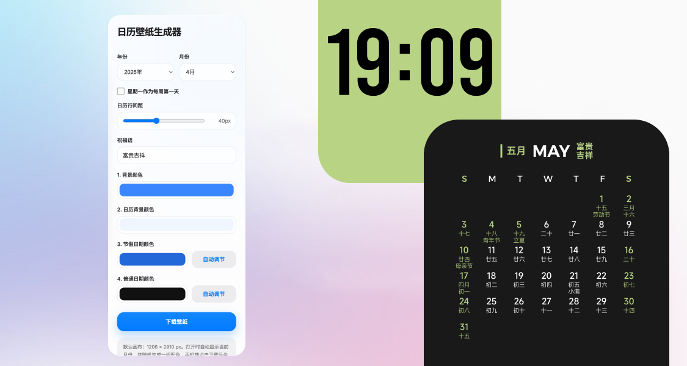

# iOS Calendar Wallpaper Generator

Create iOS-style calendar wallpapers directly in your browser.  
No app needed — customize and export instantly.

👉 https://aeceywan.github.io/calendar-wallpaper/

---

## ✨ Features

- 📱 Clean, iOS-inspired design  
- 🎨 Flexible color customization  
- 🗓 Gregorian + Chinese lunar calendar + holidays  
- 🔤 Chinese & English month display  
- 🎉 Custom 4-character blessing text  
- 🔄 Week start toggle (Sunday / Monday)  
- 🖼 High-resolution export (1206 × 2910 px)

---

## 📥 Usage

1. Open the page  
2. Customize colors, month, and text  
3. Generate and download  

- 💻 Desktop: direct PNG download  
- 📱 Mobile: long press to save image  

---

## 🇨🇳 中文介绍

一个基于浏览器的 iOS 风格日历壁纸生成工具，无需下载即可使用。

👉 https://aeceywan.github.io/calendar-wallpaper/

### ✨ 功能

- 📱 简约 iOS 风格设计  
- 🎨 支持多种颜色自定义  
- 🗓 公历 + 农历 + 节假日  
- 🔤 中英文月份显示  
- 🎉 自定义祝福语  
- 🔄 支持周一 / 周日作为起始  
- 🖼 高清导出（1206 × 2910 px）

---

## 🛠 Tech Stack

- HTML / CSS / JavaScript  
- html2canvas  
